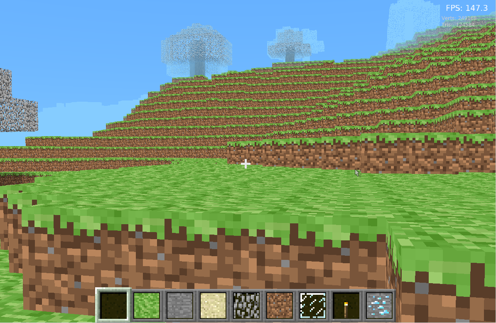
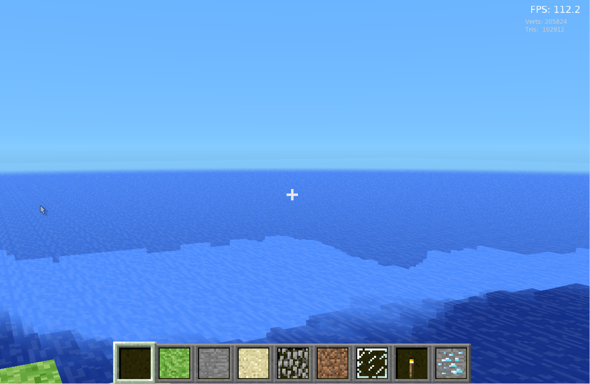
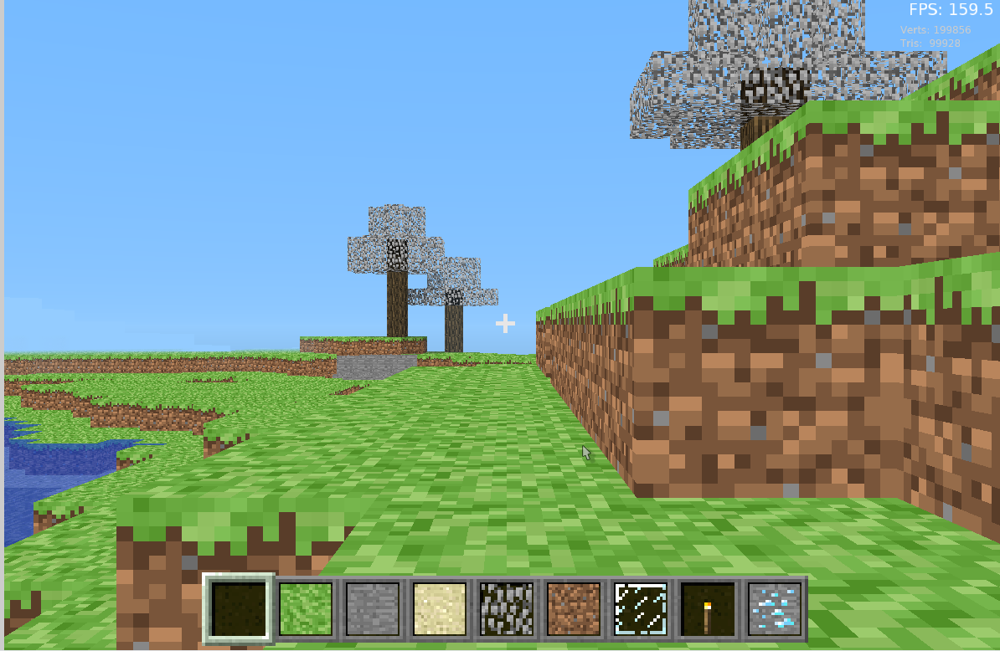
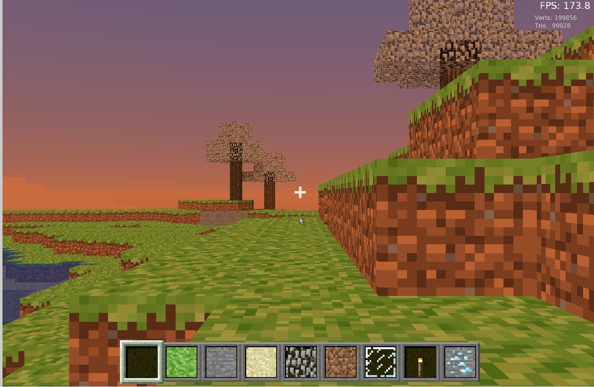
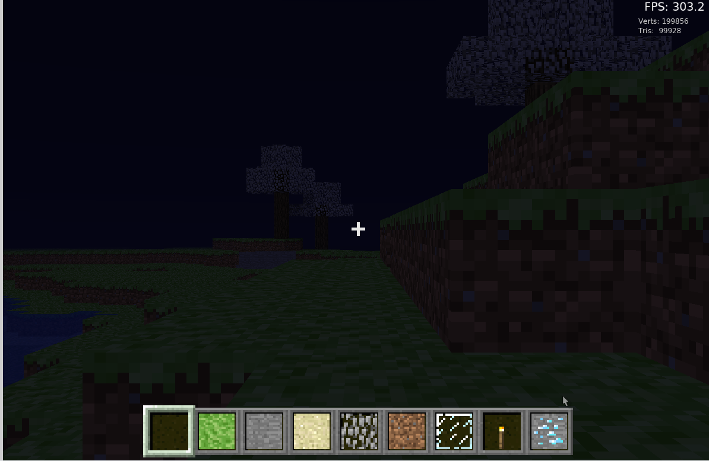
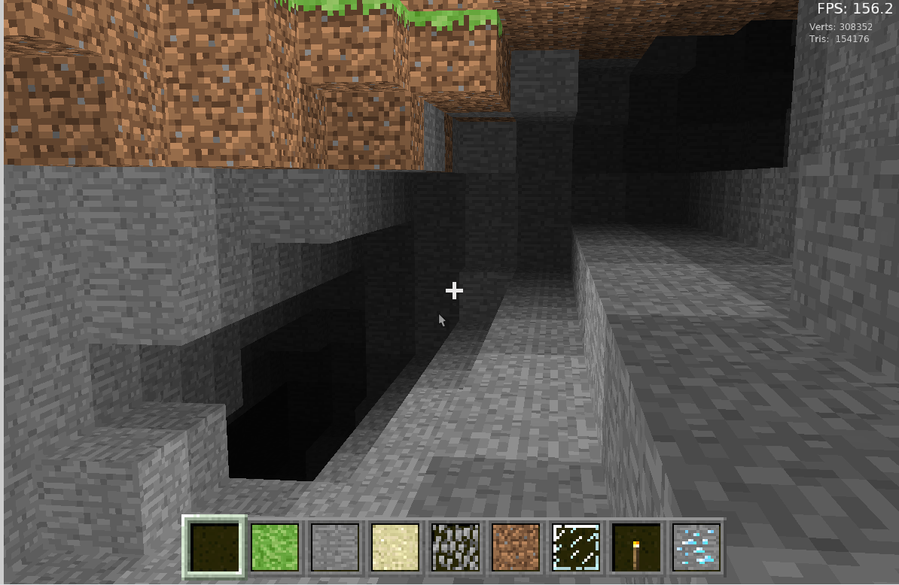
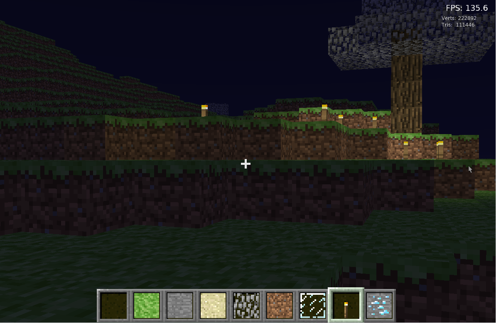

<div align="center">

# Homemade Minecraft

基于 **C++ / OpenGL 4.5** 的 Minecraft 克隆项目，用于学习计算机图形学和游戏开发。


</div>

---

## 效果展示

### 世界生成

多层柏林噪声（FBM）+ 样条曲线映射，自动生成多样地貌与树木。

| 陆地丘陵 | 海洋 |
|:---:|:---:|
|  |  |

### 昼夜循环

动态天空系统驱动昼夜交替，天空颜色与环境光随时间平滑渐变。

| 白天 | 黄昏 & 清晨 | 夜晚 |
|:---:|:---:|:---:|
|  |  |  |

### 光照系统

双通道光照：天空光随昼夜变化，方块光（火把）夜晚恒亮。3D 噪声生成洞穴系统。

| 洞穴探索 | 火把照明 |
|:---:|:---:|
|  |  |

---

## 功能特性

<table>
<tr><td>

**世界生成**
- 多层柏林噪声 + 样条曲线映射
- 平原、丘陵、山地、海洋等地貌
- 3D 噪声洞穴系统
- 噪声驱动的树木自动生成
- 14 种方块类型

</td><td>

**双通道光照**
- 天空光（0~15）：直射 + BFS 衰减传播
- 方块光（0~14）：火把独立传播，夜晚恒亮
- 增量更新：四级更新等级调度
- 跨区块 BFS 传播

</td></tr>
<tr><td>

**渲染**
- 动态天空：时间驱动颜色渐变
- 透明渲染：两遍渲染 + 逐面片距离排序
- 距离雾化：smoothstep 融合天空色
- 视锥体剔除 + 延迟构建
- Alpha Test 树叶镂空渲染

</td><td>

**交互与物理**
- 射线检测方块选中高亮
- 方块放置与破坏
- 重力 + 跳跃 + AABB 碰撞检测
- 第一 / 第三人称视角切换
- HUD：准星、工具栏、FPS 显示

</td></tr>
</table>

---

## 快速开始

### 依赖

- OpenGL 4.5+、GLFW3、GLM、FreeType2
- GLAD（已包含在 `lib/glad/`）

```bash
# Ubuntu/Debian
sudo apt install -y libglfw3-dev libglm-dev libfreetype-dev
```

### 构建与运行

```bash
mkdir build && cd build
cmake ..
make -j$(nproc)
./MyMinecraft
```

---

## 操作说明

| 按键 | 功能 | 按键 | 功能 |
|:---:|:---:|:---:|:---:|
| W/A/S/D | 移动 | 鼠标 | 视角控制 |
| 空格 | 跳跃 | R | 切换第一/第三人称 |
| 鼠标左键 | 放置方块 | 鼠标右键 | 破坏方块 |
| 1-9 | 选择工具栏槽位 | 滚轮 | 缩放视野 |
| Tab | 释放/捕获光标 | ESC | 退出 |

---

## 项目结构

```
minecraft/
├── main.cpp                 # 程序入口
├── src/
│   ├── core/                # 游戏主循环、摄像机、全局常量
│   ├── world/               # 区块(32x128x32)、地形管理、方块定义、柏林噪声
│   ├── entity/              # 玩家、碰撞检测、天空盒
│   ├── render/              # 着色器封装、纹理加载、顶点结构
│   ├── ui/                  # HUD、工具栏、方块选择、文字渲染
│   └── utils/               # stb_image 图像加载
├── shaders/                 # GLSL 着色器（方块/天空/选中高亮/HUD/文字）
├── Textures/                # 纹理资源
└── lib/glad/                # GLAD 库
```

---

<div align="center">

**License:** 无，just for fun.

</div>
