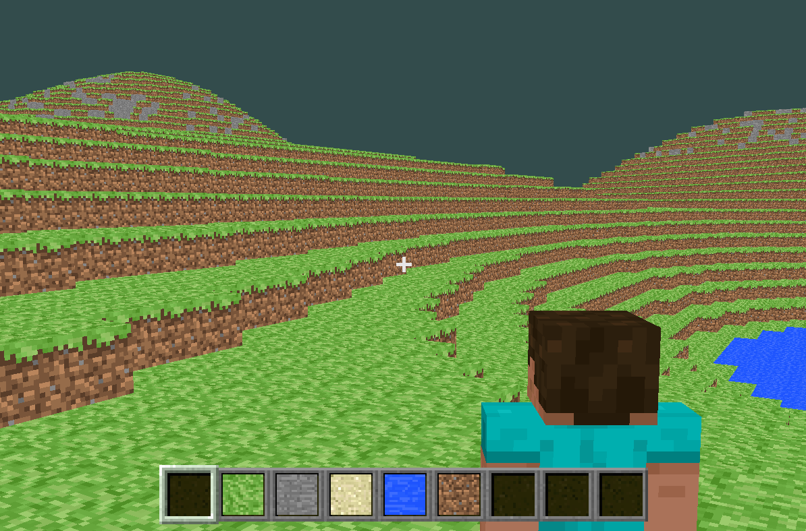

# Homemade Minecraft

基于 C++ 和 OpenGL 4.5 的 Minecraft 克隆项目，用于学习计算机图形学和游戏开发。



## 功能特性

**世界生成**
- 多层柏林噪声（FBM）+ 样条曲线映射，生成深海、浅海、海岸、平原、丘陵、山地等地貌
- 3D 噪声生成洞穴系统
- 13 种方块类型：草方块、石头、沙子、水、泥土、木头、玻璃、煤矿、铁矿、金矿、钻石、火把

**双通道光照系统**
- 天空光（0\~15）：天空光柱直射 + BFS 衰减传播，受昼夜 ambientColor 调制
- 方块光（0\~14）：火把等发光方块独立传播，夜晚恒亮不受环境光影响
- 浮点编码合并传输：`LightLevel = sky + block/16`，顶点着色器精确解码
- 增量更新：放置/破坏方块仅更新受影响区域，四级更新等级调度
- 跨区块传播：方块光 BFS 可穿越区块边界

**渲染**
- 动态天空系统：时间驱动的天空颜色渐变 + 全屏四边形渲染
- 透明渲染：两遍渲染（不透明 → Alpha 混合），逐面片距离排序
- 距离雾化：smoothstep 雾化融合天空色
- 视锥体剔除：chunk 级 AABB 剔除，不可见区块延迟构建
- 仅渲染与空气接触的表面，边界面片定向重建

**交互与物理**
- 射线检测方块选中高亮，支持放置和破坏
- 重力 + 跳跃 + AABB 碰撞检测
- 第一人称/第三人称视角切换
- Steve 风格玩家模型（64×64 皮肤纹理）
- HUD：准星、9 格工具栏、FPS/顶点数实时显示

## 快速开始

### 依赖

- OpenGL 4.5+、GLFW3、GLM、FreeType2
- GLAD（已包含在 `lib/glad/`）

```bash
# Ubuntu/Debian
sudo apt install -y libglfw3-dev libglm-dev libfreetype-dev
```

### 构建与运行

```bash
mkdir build && cd build
cmake ..
make -j$(nproc)
./MyMinecraft
```

## 操作说明

| 按键 | 功能 | 按键 | 功能 |
|------|------|------|------|
| W/A/S/D | 移动 | 鼠标 | 视角控制 |
| 空格 | 跳跃 | R | 切换第一/第三人称 |
| 鼠标左键 | 放置方块 | 鼠标右键 | 破坏方块 |
| 1-9 | 选择工具栏槽位 | 滚轮 | 缩放视野 |
| ESC | 退出 | | |

## 项目结构

```
├── main.cpp                 # 程序入口
├── src/
│   ├── core/                # 游戏主循环、摄像机、全局常量
│   ├── world/               # 区块(32×128×32)、地形管理、方块定义、柏林噪声
│   ├── entity/              # 玩家、碰撞检测、天空盒
│   ├── render/              # 着色器封装、纹理加载、顶点结构
│   ├── ui/                  # HUD、工具栏、方块选择、文字渲染
│   └── utils/               # stb_image 图像加载
├── shaders/                 # GLSL 着色器（方块/天空/选中高亮/HUD/文字）
├── Textures/                # 纹理资源
└── lib/glad/                # GLAD 库
```

## 许可证

无，just for fun.
